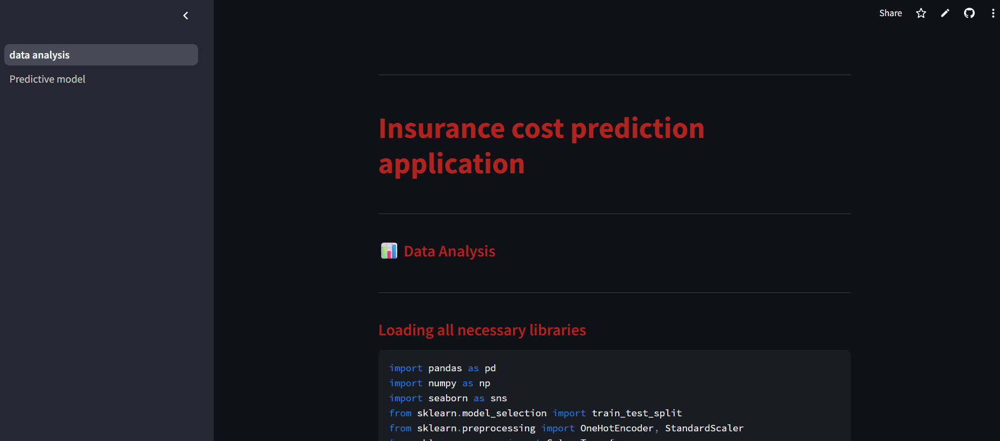
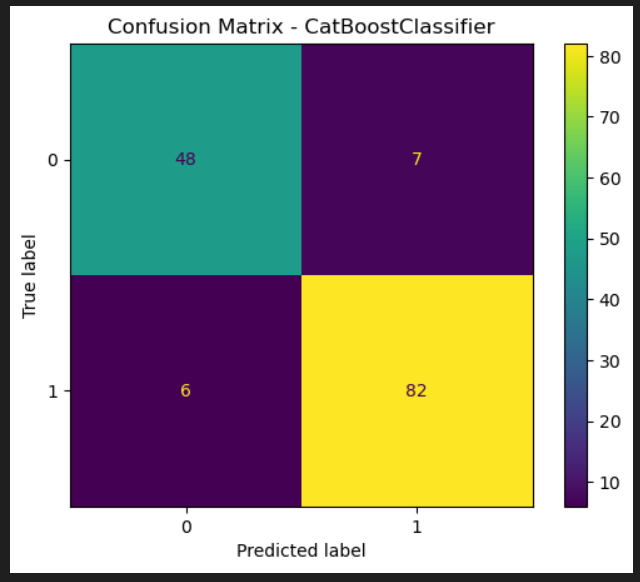
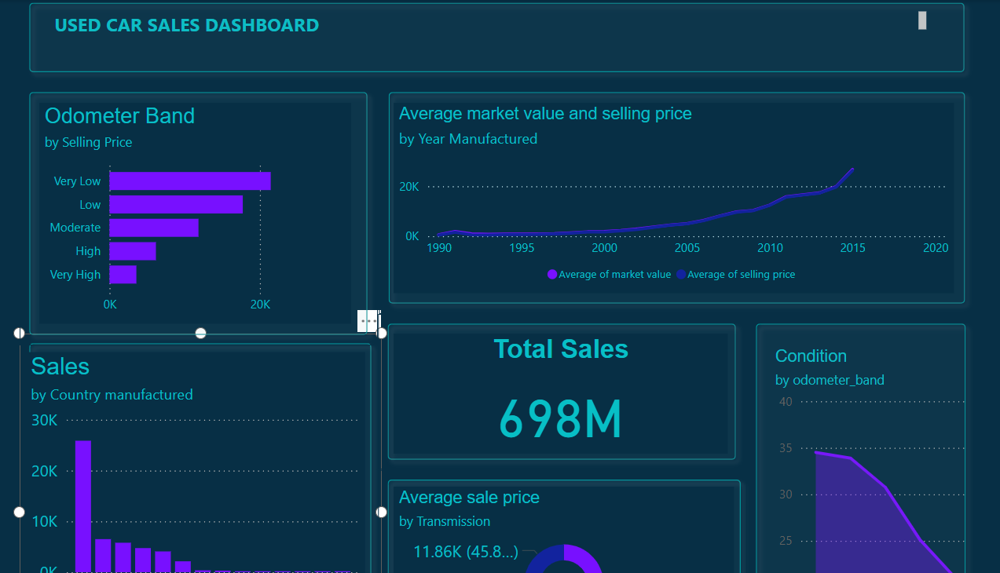
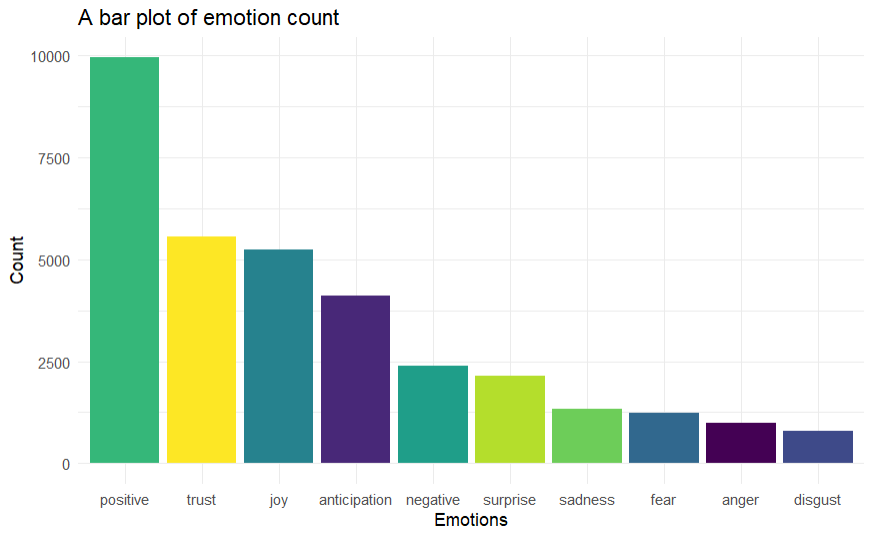

# 👋 Hi, I'm Obadiah Kiptoo

🎓 MS in Data Science & Analytics @ Grand Valley State University, Michigan U.S.A  
🎓 BSc in Applied Statistics with Computingv@ Moi University, Kenya  
💡 Currently: Freelance Data Analyst | Student Data scientist | ML Enthusiast  
🌍 From Kenya | Student Based in the U.S.A

---

I have a strong foundation in Statistics from my undergraduate degree in applied statistics with computing. My MSc in Data Science and Analytics builds on my existing statistics knowledge by integrating my statistical rigor with Machine learning and big data tools.
I'm passionate about machine learning and excited wth applying ML knowledge to solve meaningful problems.
I enjoy working through the full lifecycle of any data related problem from ML projects to uncovering underlying data insights. I am open to new challenges and collaborations, feel free to reach out to me

---

## 🧑🏻‍🍳 Currently working on

- **Udemy Data Science Boot camp by 365 Careers**
  

---

## 🚀 What I have worked On

- **Insurance charges prediction streamlit app - Partnering with Build Fellowship** Building a ML powered streamlit app that predicts an inidividual health insurance charges based on lifestyle and personal factors. I also engineered features by creating new features such as bmi_smoker to enhance predictive accuracy of the models. Fitting and training Linear regression model, Random Forest regressor, XGBoost regressor and LightGBM model.
  [Live app](https://health-insurance-app-app-zks4tkjnbak6wcycvr5b76.streamlit.app/)

- 🧬 **Breast Cancer Diagnosis App**: Classification of breast lumps as malignant or benign using the wisconsin breast cancer dataset. Used Logistic regression and CatBoostClassifier model for advanced boosting. Deployed my optimal model using streamlit. Developed an alternative app using Javascript for frontend development, FLASK API to access and retrieve predictions fro deployed model, HTML and CSS for styling, and axios to send requests to the API and receive predictions in form of JSON objects.
- 🚗 **Car Price data ETL Pipeline and Visualization**: Used docker for containeriation,PostgreSQL for data storage, Kestra to facilitate data orchestration, Python for scripting Extraction Transformation and Data Loading, and Power BI for data Visualization.
- 📝 **Sentiment Analysis** of restaurant reviews using `tidytext`, `syuzhet`, `textdata`, `dplyr`, and `flextable` packages in R.

---

## 🧰 Tools & Technologies

**Languages:** Python| R| PotgreSQL|Javascript|HTML|CSS 
**ML & Data Science:** Scikit-learn| XGBoost| LightGBM|CatBoost|caret|e1071|rpart|tidymodels  
**Visualization:** Power BI| ggplot2| Plotly| Tableau| Streamlit|FlexDashboards  
**Data Handling:** Pandas| Tidyverse| PostgreSQL| Kestra|Google sheets|Excel  
**DevOps:** Git| GitHub| Docker

---

## Featured Projects

### 🏥 Health insurance charges cost prediction app

> A user-friendly Streamlit web application that predicts individual health insurance charges based on demographic and lifestyle information. Built using Random Forest, with support for other models like Linear Regression, LightGBM, and XGBoost for comparison.

> Data analysis page that describes all procedures taken in data analysis and determination of optimal model deployed for predictions.

> [Live app](https://health-insurance-app-app-zks4tkjnbak6wcycvr5b76.streamlit.app/) | [📂 Code](https://github.com/obed254github/health-insurance-streamlit-app)
> 
---

### 🧬 Breast Cancer Predictor

> A diagnostic app using CatBoost to classify tumors as benign or malignant  
> [🔗 Live App](https://breast-cancer-detection-iw4xkj8d9vzatwzyk9hsta.streamlit.app/) | [📂 Code](https://github.com/obed254github/breast-cancer-detection)  
> 

---

### 🚗 Car Sales ETL Pipeline

> Full ETL pipeline with feature engineering, ETL orchestration via Kestra, and Power BI dashboard  
> [📂 Code](https://github.com/obed254github/car-sales-ml-pipeline)  
> 

---

### Sentiment analysis of restaurant reviews

> Sentiment analysis of restaurant reviews involves using natural language processing (NLP) techniques to determine whether a review expresses a positive, negative, or neutral sentiment.
> [📂 Code](https://github.com/obed254github/Restaurant-Sentiment-Analysis-in-R) > 

<!-- ### 📊 US Economic & Housing Dashboard
> R Flexdashboard visualizing poverty, income, and rent trends across states
[📂 Code](https://github.com/yourusername/us-census-dashboard)
 -->

<!-- ## 📈 GitHub Stats

  

  

 -->

---

## 📫 Let's Connect

- 💼 [LinkedIn](https://linkedin.com/in/obadiah-kiptoo-85480b175)
- 📨 Email: obadiahkiptoo1998@gmail.com

---

_“Turning data into insight, and insight into action.”_
